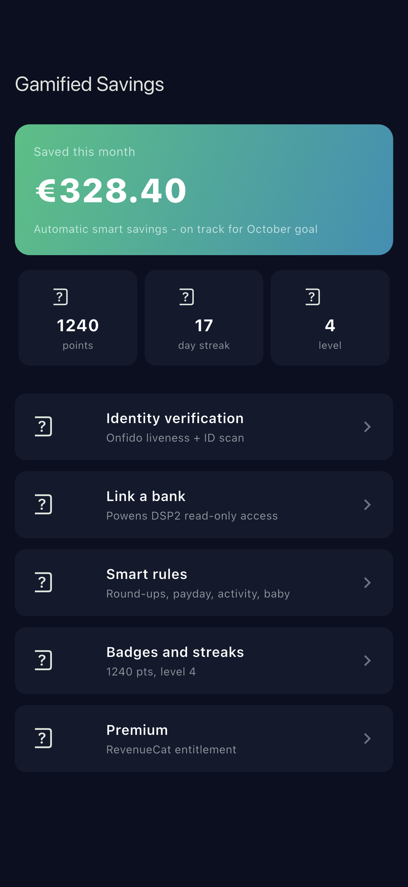
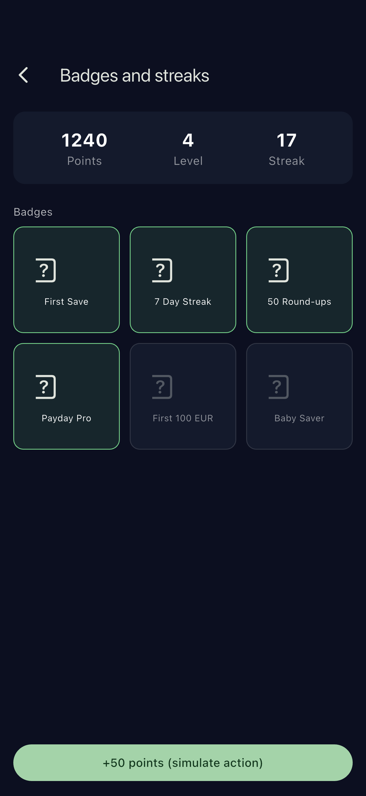
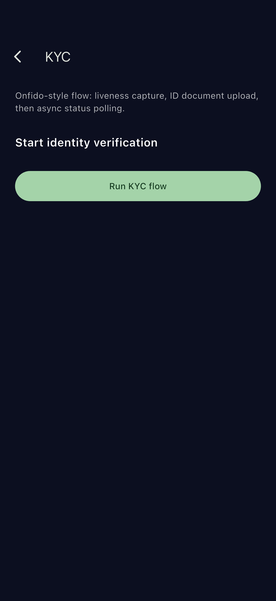

# flutter-fintech-kyc-savings

Flutter POC for a gamified automatic savings fintech app.

## Demo

Real iOS-Simulator captures from the running app (see [FLOW.md](FLOW.md) for how they are generated).

| Dashboard | Badges & streaks | Smart rules | KYC |
| --- | --- | --- | --- |
|  |  |  |  |

## What this demonstrates

- Full bank connection via Powens-style DSP2 open banking (read-only)
- KYC onboarding (Onfido-style liveness + ID verification)
- 4 smart rules: round-ups, activity-based, payday percentage, baby savings
- Gamification: points, levels, streaks, badges
- Premium subscription via RevenueCat-style purchase/restore flow
- Biometric-gated vault with flutter_secure_storage + local_auth
- Clean architecture built around Riverpod providers and service interfaces

## Stack

- Flutter + Dart
- Riverpod for state management
- go_router for navigation
- flutter_secure_storage (Keychain / Keystore)
- local_auth (Face ID / Touch ID / fingerprint)

## Architecture

- `lib/services/` wraps third-party boundaries (KYC, open banking, subscriptions, savings rules engine). Real integrations (Powens, Onfido, RevenueCat) can drop in behind the same interface.
- `lib/providers/` exposes Riverpod notifiers used by screens.
- `lib/screens/` is pure UI that reacts to providers.
- Savings rules (`savings_rules.dart`) are pure Dart functions so they can be unit-tested without Flutter.

## Keywords

Fintech, Savings, Open Banking, DSP2, PSD2, Powens, KYC, Onfido, Liveness, ID Verification, Biometric, local_auth, flutter_secure_storage, RevenueCat, Round-ups, Smart Rules, Payday Savings, Gamification, Points, Badges, Streaks, Riverpod, go_router, Flutter, Dart, iOS, Android, Cross-platform
